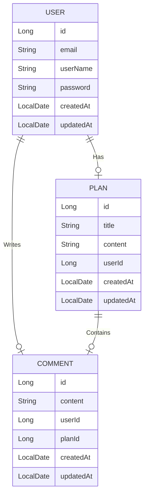

# 🗓️ Planner 만들기

## 🔗 프로젝트 목차
1. [프로젝트 소개](#프로젝트-소개)
2. [API 문서](#api-문서)
3. [ERD 다이어그램](#erd-다이어그램)

## 🍪프로젝트 소개
**Planner**는 **Spring**을 이용하여 개발된 **일정 관리 애플리케이션**입니다.  
이 애플리케이션은 사용자에게 다음과 같은 기능을 제공합니다
- **개인 일정 관리**: 생성, 조회, 수정, 삭제
- **회원 정보 관리**: 생성, 조회, 수정, 삭제
- **댓글 작성 및 관리**: 생성, 조회, 수정, 삭제

### 주요 특징
1. **로그인 기능**
    - 사용자는 로그인 상태에서만 일정, 댓글, 회원 정보를 관리 가능
2. **권한 관리**
    - 인증된 사용자만 주요 기능에 접근가능하도록 보안 기능 구현

## 📜API 문서

## 🔗 API 문서 목차

1. [일정 관련 API](#1-일정-관련-api)  
   1.1. [일정 등록 API](#11-일정-등록-api)  
   1.2. [일정 전체 조회 API](#12-일정-전체-조회-api)  
   1.3. [일정 단건 조회 API](#13-일정-단건-조회-api)  
   1.4. [일정 수정 API](#14-일정-수정-api)  
   1.5. [일정 삭제 API](#15-일정-삭제-api)  
2. [인증 관련 API](#2-인증-관련-api)  
   2.1. [회원가입 API](#21-회원가입-api)  
   2.2. [로그인 API](#22-로그인-api)  
   2.3. [로그아웃 API](#23-로그아웃-api)  
3. [사용자 관련 API](#3-사용자-관련-api)  
   3.1. [사용자 전체 조회 API](#31-사용자-전체-조회-api)  
   3.2. [사용자 조회 API](#32-사용자-조회-api)  
   3.3. [사용자 비밀번호 수정 API](#33-사용자-비밀번호-수정-api)   
   3.4. [사용자 이름 수정 API](#34-사용자-이름-수정-api)  
   3.5. [사용자 정보 삭제 API](#35-사용자-정보-삭제-api)   
4. [댓글 관련 API](#4-댓글-관련-api)  
   4.1. [댓글 등록 API](#41-댓글-등록-api)  
   4.2. [댓글 전체 조회(userId) API](#42-댓글-전체-조회-userid-api)  
   4.3. [댓글 전체 조회(planId) API](#43-댓글-전체-조회-planid-api)  
   4.4. [댓글 단건 조회(commentId) API](#44-댓글-단건-조회-commentid-api)  
   4.5. [댓글 수정 API](#45-댓글-수정-api)  
   4.6. [댓글 삭제 API](#46-댓글-삭제-api)  
   
## 1. 일정 관련 API

| 기능       | Method   | 엔드포인트               |
|----------|----------|---------------------|
| 일정 등록    | `POST`   | `/plans`            |
| 일정 전체 조회 | `GET`    | `/plans`            |
| 일정 단건 조회 | `GET`    | `/plans/{planId}`   |
| 일정 수정    | `PATCH`  | `/plans/{planId}`   |
| 일정 삭제    | `DELETE` | `/plans/{planId}`   |

<br>

## 1.1 일정 등록 API

| **Method** | **엔드포인트**          |
|----------|----------------------|
| `POST`    | `/plans`      |

#### 요청 본문
```json
{
  "title":   "일정 제목",
  "content": "일정 내용"
}
```
#### 응답 예시
- 성공
```json
{
  "message": "일정이 등록되었습니다.",
  "success": true,
  "data": {
    "id": 1,
    "userName":  "로그인한 사용자 이름",
    "title":     "일정 제목",
    "content":   "일정 내용",
    "createdAt": "2024-12-19",
    "updatedAt": "2024-12-19"
  }
}
```
- 로그인 상태가 아닐 때
```json
{
  "timestamp": "2024-12-19T01:22:47.779+00:00",
  "status": 500,
  "error": "Internal Server Error",
  "path": "/plans"
}
```
#### 상태 코드
| **상태**              | **응답 코드**   | **메시지**            |
|-----------------------|-----------------|--------------------|
| **성공**              | `201 CREATED`   | 일정이 등록되었습니다.  |
| **로그인 상태가 아님** | `401 UNAUTHORIZED` | 로그인이 필요합니다.  | 

<br>

## 1.2 일정 전체 조회 api
| **Method** | **엔드포인트**         |
|---------|----------------------|
| `GET`    | `/plans`      |

#### 요청 쿼리
| **파라미터**    | **타입**   | **필수 여부** | **설명**           |
|-------------|----------|:----------:|------------------|
| `userId`    | `Long`   |    선택    | 사용자 고유식별자        |
| `updatedAt` | `String` |    선택    | yyyy-MM-DD 형식의 날짜 |
#### 예시 요청
`GET` /plans?userId=&date=
#### 응답 예시
- 성공
```json
{
  "message": "일정이 조회되었습니다.",
  "success": true,
  "data": {
    "plans": [
      {
        "id": 1,
        "userName": "사용자",
        "title": "일정1 제목",
        "content": "`일정1 내용`",
        "createdAt": "2024-12-19",
        "updatedAt": "2024-12-19"
      },
      {
        "id": 2,
        "userName": "사용자",
        "title": "일정2 제목",
        "content": "일정2 제목",
        "createdAt": "2024-12-19",
        "updatedAt": "2024-12-19"
      }
    ]
  }
}
```
- 요청받은 일정이 없을 때
```json
{
  "message": "일정이 존재하지 않습니다.",
  "success": false,
  "data": null
  }
```

#### 상태 코드
| **상태**     | **응답 코드**       | 
|------------|-----------------|
| **성공**     | `200 OK`        |
| **일정이 없음** | `404 NOT_FOUND` |
<br>

## 1.3 일정 단건 조회 api
| **Method** | **엔드포인트**          |
|---------|-----------------------|
| `GET`    | `/plans/{planId}`      |

#### 요청 쿼리
| **파라미터** | **타입**    | **필수 여부** | **설명**  |
|----------|-----------|:---------:|---------|
| `planId` | `Long`    |    필수     | 일정 번호   |

#### 예시 요청
`GET` /plans/1
#### 응답 예시
- 성공
```json
{
  "message": "일정이 조회되었습니다.",
  "success": true,
  "data": {
    "id": 1,
    "userName": "사용자명",
    "title": "일정1 제목",
    "content": "일정1 내용",
    "createdAt": "2024-12-19",
    "updatedAt": "2024-12-19"
  }
}
```
- 요청받은 일정이 없을 때
```json
{
  "message": "일정이 존재하지 않습니다.",
  "success": false,
  "data": null
  }
```

#### 상태 코드

| **상태**     | **응답 코드**       | **메시지**            |
|------------|-----------------|--------------------|
| **성공**     | `200 OK`        | 일정이 조회되었습니다.  |
| **일정이 없음** | `404 NOT_FOUND` | 일정이 존재하지 않습니다.  | 

<br>

## 1.4 일정 수정 api
| **Method** | **엔드포인트**          |
|------------|------------------------|
| `PATCH`    | `/plans/{planId}`      |

#### 요청 쿼리
| **파라미터** | **타입**    | **필수 여부** | **설명**  |
|----------|-----------|:---------:|---------|
| `planId` | `Long`    |    필수     | 일정 번호   |

#### 요청 본문
| **파라미터** | **타입**    | **필수 여부** | **설명**  |
|----------|-----------|:---------:|---------|
| `title`  | `String`  |    필수     | 일정 제목   |
| `content`| `String`  |    선택     | 일정 내용   |

#### 예시 요청 
`PATCH` /plans/1

#### 요청 본문 예시
```json
{
  "title":   "수정할 일정 제목",
  "content": "수정할 일정 내용"
}
```
#### 응답 예시
- 성공
```json
{
  "message": "일정이 수정되었습니다.",
  "success": true,
  "data": {
    "id": 1,
    "userName": "사용자명",
    "title": "일정1 수정된 제목",
    "content": "일정1 수정된 내용",
    "createdAt": "2024-12-19",
    "updatedAt": "2024-12-19"
  }
}
```
- 요청받은 일정이 없을 때
```json
{
  "message": "일정이 존재하지 않습니다.",
  "success": false,
  "data": null
  }
```
- 로그아웃 상태일 때
```json
{
  "timestamp": "2024-12-19T01:22:47.779+00:00",
  "status": 500,
  "error": "Internal Server Error",
  "path": "/plans"
}
```
- 수정 권한이 없을 때
```json
{
  "message": "수정 권한이 없습니다",
  "success": false,
  "data": null
}
```
#### 상태 코드
| **상태**       | **응답 코드**  | **메시지**        |
|--------------|----------------|----------------|
| **성공**       | `200 OK`   | 일정이 수정되었습니다.   |
| **일정이 없음** | `404 NOT_FOUND` | 일정이 존재하지 않습니다. |
| **로그아웃 상태**  | `401 UNAUTHORIZED` | 로그인이 필요합니다.    |
| **수정 권한 없음** | `403 FORBIDDEN` | 수정 권한이 없습니다.   |

<br>

## 1.5 일정 삭제 api
| **Method** | **엔드포인트**          |
|------------|------------------------|
| `DELETE`   | `/plans/{planId}`      |

#### 요청 쿼리
| **파라미터** | **타입**    | **필수 여부** | **설명**  |
|----------|-----------|:---------:|---------|
| `planId` | `Long`    |    필수     | 일정 번호   |

#### 예시 요청
`DELETE` /plans/1

#### 응답 예시
- 성공
```json
{
  "message": "일정이 삭제되었습니다.",
  "success": true
}
```
- 요청받은 일정이 없을 때
```json
{
  "message": "일정이 존재하지 않습니다.",
  "success": false,
  "data": null
  }
```
- 로그아웃 상태일 때
```json
{
  "timestamp": "2024-12-19T01:22:47.779+00:00",
  "status": 500,
  "error": "Internal Server Error",
  "path": "/plans"
}
```
- 삭제 권한이 없을 때
```json
{
  "message": "삭제 권한이 없습니다",
  "success": false,
  "data": null
}
```
#### 상태 코드
| **상태**       | **응답 코드**  | **메시지**      |
|--------------|----------------|--------------|
| **성공**       | `200 OK`   | 일정이 삭제되었습니다. |
| **일정이 없음** | `404 NOT_FOUND` | 일정이 존재하지 않습니다. |
| **로그아웃 상태**  | `401 UNAUTHORIZED` | 로그인이 필요합니다.  |
| **삭제 권한 없음** | `403 FORBIDDEN` | 삭제 권한이 없습니다. |

<br>

## 2. 인증 관련 API
| 기능   | Method | 엔드포인트          |
|------|--------|----------------|
| 회원가입 | `POST` | `/auth/signup` |
| 로그인  | `POST` | `/auth/login`  |
| 로그아웃 | `POST` | `/auth/logout` |

<br>

## 2.1 회원가입 API

| **Method** | **엔드포인트**      |
|--------|----------------|
| `POST`  | `/auth/signup` |

#### 요청 본문
| **파라미터**   | **타입**    | **필수 여부** | **설명**    | **중복 허용** |
|--------------|------------|:------------:|-----------|:------------:|
| `email`      | `String`   |     필수     | 사용자 메일 주소 | 불가         |
| `userName`   | `String`   |     필수     | 사용자명      | 가능         |
| `password`   | `String`   |     필수     | 비밀번호      | 가능         |


#### 요청 본문 예시
```json
{
  "email" : "사용자 메일 주소",
  "userName" : "사용자명",
  "password" : "비밀번호"
}
```
#### 응답 예시
- 성공
```json
{
  "message": "회원가입이 완료되었습니다.",
  "success": true,
  "data": {
    "email": "사용자 메일 주소",
    "userName": "사용자명"
  }
}
```
- 이미 등록된 메일주소일 때
```json
{
  "message": "이미 등록된 이메일입니다.",
  "success": false,
  "data": null
}
```
- 유효하지 않은 값이 입력되었을 때
```json
{
  "message": "입력값이 잘못되었습니다.",
  "success": false,
  "data": null
}
```
#### 상태 코드
| **상태**           | **응답 코드**         | **메시지**        |
|------------------|-------------------|----------------|
| **성공**           | `200 OK`          | 회원가입이 완료되었습니다. | 
| **중복 메일 주소**     | `409 Conflict`    | 이미 등록된 이메일입니다. | 
| **입력값이 유효하지 않음** | `400 Bad Request` | 입력값이 잘못되었습니다.  | 

<br>

## 2.2 로그인 api

| **Method** | **엔드포인트**     |
|----------|---------------|
| `POST`    | `/auth/login` |

#### 요청 본문
| **파라미터**   | **타입**    | **필수 여부** | **설명**    |
|--------------|------------|:------------:|-----------|
| `email`      | `String`   |     필수     | 사용자 메일 주소 | 
| `password`   | `String`   |     필수     | 비밀번호      |

#### 요청 본문 예시
```json
{
  "email" : "사용자 메일 주소",
  "password" : "비밀번호"
}
```
#### 응답 예시
- 성공
```json
{
  "message": "로그인 되었습니다.",
  "success": true,
  "data": {
    "email" : "사용자 메일 주소",
    "password" : "비밀번호"
  }
}
```
- 아이디 또는 비밀번호 오류
```json
{
  "message": "존재하지 않는 email 입니다.",
  "success": false,
  "data": null
}
```
```json
{
  "message": "비밀번호가 올바르지 않습니다.",
  "success": false,
  "data": null
}
```
#### 상태 코드
| **상태**        | **응답 코드**          | **메시지**            |
|---------------|--------------------|--------------------|
| **성공**        | `200 OK`           | 로그인 성공             | 
| **email 미존재** | `401 UNAUTHORIZED` | 존재하지 않는 email 입니다. | 
| **비밀번호 불일치**  | `401 UNAUTHORIZED`  | 비밀번호가 올바르지 않습니다.   |
<br>

## 2.3 로그아웃 api

| **Method** | **엔드포인트**      |
|---------|----------------|
| `DELETE` | `/auth/logout` |

#### 응답 예시
- 성공
```json
{
  "message": "로그아웃 되었습니다.",
  "success": true,
  "data": {
    "email": "사용자 메일 주소",
    "userName": "사용자명"
  }
}
```

- 이미 로그아웃 상태일 때
```json
{
    "message": "로그아웃 상태입니다.",
    "success": false,
    "data": null
}
```
#### 상태 코드
| **상태**      | **응답 코드** | **메시지**     |
|-------------|-----------|-------------|
| **성공**      | `200 OK`  | 로그아웃 성공     | 
| **로그아웃 상태** | `401 UNAUTHORIZED`    | 로그아웃 상태입니다. | 

<br>

## 3. 사용자 관련 API

| 기능            | Method   | 엔드포인트                      |
|---------------|----------|----------------------------|
| 사용자 전체 조회    | `POST`   | `/users`                   |
| 사용자 조회        | `GET`    | `/users/{userId}`          |
| 사용자 비밀번호 수정 | `PATCH`  | `/users/{Userid}/password` |
| 사용자 이름 수정    | `PATCH`  | `/users/{Userid}/userName` |
| 사용자 정보 삭제    | `DELETE` | `/users/{Userid}`          |

<br>

## 3.1 사용자 전체 조회 API

| **Method** | **엔드포인트** |
|----------|----------|
| `POST`   | `/users` |

#### 응답 예시
- 성공
```json
{
  "message": "회원정보를 조회했습니다.",
  "success": true,
  "data": {
    "users": [
      {
        "id": "사용자1 고유식별자",
        "email": "사용자1 메일 주소",
        "userName": "사용자1 사용자명",
        "createdAt": "2024-12-19",
        "updatedAt": "2024-12-19"
      },
      {
        "id": "사용자2 고유식별자",
        "email": "사용자2 메일 주소",
        "userName": "사용자2 사용자명",
        "createdAt": "2024-12-19",
        "updatedAt": "2024-12-19"
      }
    ]
  }
}
```
- 사용자 정보가 없을 때
```json
{
  "message": "유저 정보가 없습니다.",
  "success": false,
  "data": null
}
```

#### 상태 코드
| **상태**        | **응답 코드**       | **메시지**            |
|---------------|-----------------|--------------------|
| **성공**        | `200 OK`        | 회원정보를 조회했습니다.  |
| **사용자 정보 없음** | `404 NOT FOUND` | 유저 정보가 없습니다.  |

<br>

## 3.2 사용자 조회 API

| **Method** | **엔드포인트**      |
|---------|----------------------|
| `GET`    | `/users/{userId}`   |

#### 요청 쿼리
| **파라미터** | **타입**    | **필수 여부** | **설명**    |
|----------|-----------|:---------:|-----------|
| `userId` | `Long`    |    필수     | 사용자 고유식별자 |

#### 예시 요청
`GET` /users/1

#### 응답 예시
- 성공
```json
{
  "message": "회원정보를 조회했습니다.",
  "success": true,
  "data": {
    "id": "사용자1 고유식별자",
    "email": "사용자1 메일 주소",
    "userName": "사용자1 사용자명",
    "createdAt": "2024-12-19",
    "updatedAt": "2024-12-19"
  }
}
```

- 사용자1의 정보가 없을 때
```json
{
  "message": "유저 정보가 없습니다.",
  "success": false,
  "data": null
}
```

#### 상태 코드
| **상태**              | **응답 코드**         | 
|-----------------------|-------------------|
| **성공**              | `200 OK`          |
| **사용자 정보 없음** | `404 NOT FOUND` | 유저 정보가 없습니다.  |

<br>

## 3.3 사용자 비밀번호 수정 API

| **Method** | **엔드포인트**                  |
|---------|----------------------------|
| `PATCH`  | `/users/{Userid}/password` |

#### 요청 쿼리
| **파라미터** | **타입**    | **필수 여부** | **설명**    |
|----------|-----------|:---------:|-----------|
| `userId` | `Long`    |    필수     | 사용자 고유식별자 |

#### 요청 본문
| **파라미터**   | **타입**    | **필수 여부** | **설명**    |
|--------------|------------|:------------:|-----------|
| `password`   | `String`   |     필수     | 비밀번호      |

#### 예시 요청
`PATCH` /users/1/password

#### 응답 예시
- 성공
```json
{
  "message": "비밀번호를 수정했습니다.",
  "success": true,
  "data": {
    "id": "사용자1 고유식별자",
    "email": "사용자1 메일주소",
    "userName": "사용자1 사용자명",
    "createdAt": "2024-12-19",
    "updatedAt": "2024-12-19"
  }
}
```
- 로그아웃 상태일 때
```json
{
    "timestamp": "2024-12-19T02:50:11.907+00:00",
    "status": 500,
    "error": "Internal Server Error",
    "path": "/users/2/userName"
}
```
- 수정권한이 없을 때
```json
{
    "message": "수정 권한이 없습니다",
    "success": false,
    "data": null
}
```
#### 상태 코드
| **상태**        | **응답 코드**          | **메시지**            |
|---------------|--------------------|--------------------|
| **성공**              | `200 OK`           | 비밀번호를 수정했습니다. |
| **로그인 상태가 아님** | `401 UNAUTHORIZED` | 로그인이 필요합니다.|
| **수정 권한이 없음** | `403 FORBIDDEN`    | 수정 권한이 없습니다. |

<br>

## 3.4 사용자 이름 수정 API

| **Method** | **엔드포인트**          |
|------------|------------------------|
| `PATCH`  | `/users/{Userid}/userName` |

#### 요청 쿼리
| **파라미터** | **타입**    | **필수 여부** | **설명**    |
|----------|-----------|:---------:|-----------|
| `userId` | `Long`    |    필수     | 사용자 고유식별자 |

#### 요청 본문
| **파라미터**   | **타입**    | **필수 여부** | **설명**    |
|--------------|------------|:------------:|-----------|
| `userName`   | `String`   |     필수     | 사용자명      |

#### 예시 요청
`PATCH` /users/1/userName

#### 요청 본문
```json
{
  "userName" : "사용자1 사용자명"
}
```
#### 응답 예시
- 성공
```json
{
  "message": "사용자 이름을 수정했습니다.",
  "success": true,
  "data": {
    "id": "사용자1 고유식별자",
    "email": "사용자1 메일주소",
    "userName": "사용자1 사용자명",
    "createdAt": "2024-12-19",
    "updatedAt": "2024-12-19"
  }
}

```
- 로그인 상태가 아닐 때
```json
{
  "timestamp": "2024-12-19T02:50:11.907+00:00",
  "status": 500,
  "error": "Internal Server Error",
  "path": "/users/2/userName"
}
```
- 수정 권한이 없을 때
```json
{
  "message": "수정 권한이 없습니다.",
  "success": false
}
```
#### 상태 코드
| **상태**              | **응답 코드**          | **메시지**    |
|-----------------------|--------------------|------------|
| **성공**              | `200 OK`           | 사용자 이름을 수정했습니다. |
| **로그인 상태가 아님** | `401 UNAUTHORIZED` | 로그인이 필요합니다.|
| **수정 권한이 없음** | `403 FORBIDDEN`    | 수정 권한이 없습니다. |

<br>

## 3.5 사용자 정보 삭제 API
| **Method** | **엔드포인트**         |
|------------|-----------------------|
| `DELETE` | `/users/{Userid}`       |

#### 예시 요청
`DELETE` /users/1

#### 응답 예시
- 성공
```json
{
  "message": "회원정보를 삭제했습니다.",
  "success": true,
  "data": null
}
```
- 로그인 상태가 아닐 때
```json
{
  "message": "로그인이 필요합니다.",
  "success": false
}
```
- 수정 권한이 없을 때
```json
{
  "message": "삭제 권한이 없습니다.",
  "success": false
}
```
#### 상태 코드
| **상태**         | **응답 코드**  | **메시지**      |
|----------------|----------------|--------------|
| **성공**         | `200 OK`   | 일정이 삭제되었습니다. |
| **로그인 상태가 아님** | `401 UNAUTHORIZED` | 로그인이 필요합니다.  |
| **삭제 권한이 없음**  | `403 UNAUTHORIZED` | 삭제 권한이 없습니다. |

<br>

## 4. 댓글 관련 API

| 기능                   | Method   | 엔드포인트                      |
|----------------------|----------|----------------------------|
| 댓글 등록                | `POST`   | `/comments/planId`         |
| 댓글 전체 조회(userId)    | `GET`    | `/comments/users/{userId}` |
| 댓글 전체 조회(planId)    | `GET`    | `/comments/plans/{planId}` |
| 댓글 단건 조회(commentId) | `GET`    | `/comments/{commentId}`    |
| 댓글 수정                | `PATCH`  | `/comments/{commentId}`    |
| 댓글 삭제                | `DELETE` | `/comments/{commentId}`    |

<br>

## 4.1 댓글 등록 API

| **Method** | **엔드포인트**          |
|----------|--------------------|
| `POST`   | `/comments/planId` |

#### 요청 쿼리
| **파라미터** | **타입**    | **필수 여부** | **설명**   |
|----------|-----------|:---------:|----------|
| `planId` | `Long`    |    필수     | 일정 고유식별자 |

#### 요청 본문
| **파라미터** | **타입**    | **필수 여부** | **설명** |
|----|------------|:------------:|--------|
| `content` | `String`   |     필수     | 댓글 내용  |

#### 예시 요청
`POST` /comments/1

#### 요청 본문
```json
{
  "content" : "일정1에 작성할 댓글"
}
```
#### 응답 예시
- 성공
```json
{
  "message": "댓글이 등록되었습니다.",
  "success": true,
  "data": {
    "id": 1,
    "email": "사용자 메일주소",
    "userName": "사용자명",
    "content": "일정1에 작성할 댓글",
    "createdAt": "2024-12-19",
    "updatedAt": "2024-12-19"
  }
}
```
- 로그인 상태가 아닐 때
```json
{
  "timestamp": "2024-12-19T03:24:52.755+00:00",
  "status": 500,
  "error": "Internal Server Error",
  "path": "/comments/1"
}
```
- 요청받은 일정이 존재하지 않을 때
```json
{
    "message": "일정이 존재하지 않습니다.",
    "success": false,
    "data": null
}
```
#### 상태 코드
| **상태**      | **응답 코드**          | **메시지**       |
|-------------|--------------------|---------------|
| **성공**      | `201 CREATED`      | 댓글이 등록되었습니다.  |
| **로그아웃 상태** | `401 UNAUTHORIZED` | 로그인이 필요합니다.   |
| **일정이 없음**  | `404 NOT FOUND`    | 일정이 존재하지 않습니다. |

<br>

## 4.2 댓글 전체 조회 (userId) API

| **Method** | **엔드포인트**          |
|---------|-----------------------|
| `GET`    | `/comments/users/{userId}` |

#### 요청 쿼리
| **파라미터** | **타입**    | **필수 여부** | **설명**    |
|----------|-----------|:---------:|-----------|
| `userId` | `Long`    |    필수     | 사용자 고유식별자 |

#### 예시 요청
`GET` /comments/users/1

#### 응답 예시
- 성공
```json
{
  "message": "사용자가 작성한 댓글이 모두 조회되었습니다.",
  "success": true,
  "data": {
    "comments": [
      {
        "id": 1,
        "email": "사용자1 메일주소",
        "userName": "사용자1 사용자명",
        "content": "댓글 내용",
        "createdAt": "2024-12-19",
        "updatedAt": "2024-12-19"
      },
      {
        "id": 2,
        "email": "사용자1 메일주소",
        "userName": "사용자1 사용자명",
        "content": "댓글 내용",
        "createdAt": "2024-12-19",
        "updatedAt": "2024-12-19"
      }
    ]
  }
}

```
- 유저가 작성한 댓글이 없을 경우
```json
{
    "message": "댓글이 존재하지 않습니다.",
    "success": false,
    "data": null
}
```
- 요청받은 유저가 존재하지 않을 경우
```json
{
    "message": "유저 정보가 없습니다.",
    "success": false,
    "data": null
}
```
#### 상태 코드
| **상태**     | **응답 코드**         | **메시지**              |
|------------|-------------------|----------------------|
| **성공**     | `200 OK`          | 사용자의 댓글이 모두 조회되었습니다. |
| **댓글이 없음** | `404 NOT FOUND`   | 댓글이 존재하지 않습니다.       |
| **유저가 없음** | `404 NOT FOUND`   | 유저 정보가 없습니다.   |
<br>

## 4.3 댓글 전체 조회 (planId) API

| **Method** | **엔드포인트**          |
|---------|-----------------------|
| `GET`    | `/comments/plans/{planId}` |

#### 요청 쿼리
| **파라미터** | **타입**    | **필수 여부** | **설명**   |
|----------|-----------|:---------:|----------|
| `planId` | `Long`    |    필수     | 일정 고유식별자 |

#### 예시 요청
`GET` /comments/plans/1

#### 응답 예시
- 성공
```json
{
  "message": "일정의 댓글이 모두 조회되었습니다.",
  "success": true,
  "data": {
    "comments": [
      {
        "id": 1,
        "email": "사용자 메일주소",
        "userName": "사용자명",
        "content": "댓글 내용",
        "createdAt": "2024-12-19",
        "updatedAt": "2024-12-19"
      },
      {
        "id": 2,
        "email": "사용자 메일주소",
        "userName": "사용자명",
        "content": "댓글 내용",
        "createdAt": "2024-12-19",
        "updatedAt": "2024-12-19"
      }
    ]
  }
}
```

- 일정이 없을 경우
```json
{
  "message": "일정이 존재하지 않습니다.",
  "success": false,
  "data": null
}
```

#### 상태 코드
| **상태**     | **응답 코드**         | **메시지**             |
|------------|-------------------|---------------------|
| **성공**     | `200 OK`          | 일정의 댓글이 모두 조회되었습니다. |
| **댓글이 없음** | `404 NOT FOUND`   | 일정이 존재하지 않습니다.      |

<br>

## 4.4 댓글 단건 조회 (commentId) API

| **Method** | **엔드포인트**          |
|------------|------------------------|
| `GET`    | `/comments/{commentId}`    |

#### 요청 쿼리
| **파라미터**    | **타입**    | **필수 여부** | **설명**   |
|-------------|-----------|:---------:|----------|
| `commentId` | `Long`    |    필수     | 댓글 고유식별자 |

#### 예시 요청
`GET` /comments/1

#### 응답 예시
- 성공
```json
{
  "message": "댓글이 조회되었습니다.",
  "success": true,
  "data": {
    "id": 1,
    "email": "사용자 메일주소",
    "userName": "사용자명",
    "content": "댓글 내용",
    "createdAt": "2024-12-19",
    "updatedAt": "2024-12-19"
  }
}
```
- 해당 댓글이 없을 때
```json
{
  "message": "댓글이 존재하지 않습니다.",
  "success": false,
  "data": null
}
```

#### 상태 코드
| **상태**     | **응답 코드**       | **메시지**    |
|------------|-----------------|------------|
| **성공**     | `200 OK`        | 댓글이 조회되었습니다.. |
| **댓글이 없음** | `404 NOT FOUND` | 댓글이 존재하지 않습니다.|

<br>

## 4.5 댓글 수정 API

| **Method** | **엔드포인트**          |
|------------|------------------------|
| `PATCH`  | `/comments/{commentId}`    |

#### 요청 쿼리
| **파라미터** | **타입**    | **필수 여부** | **설명**   |
|----------|-----------|:---------:|----------|
| `commentId` | `Long`    |    필수     | 댓글 고유식별자 |

#### 요청 본문
| **파라미터** | **타입**    | **필수 여부** | **설명** |
|----|------------|:------------:|--------|
| `content` | `String`   |     필수     | 댓글 내용  |

#### 예시 요청
`PATCH` /comments/1

#### 요청 본문
```json
{
  "content": "수정할 댓글 내용"
}
```
#### 응답 예시
- 성공
```json
{
  "message": "댓글이 수정되었습니다.",
  "success": true,
  "data": {
    "id": 1,
    "email": "사용자 메일주소",
    "userName": "사용자명",
    "content": "수정 댓글",
    "createdAt": "2024-12-19",
    "updatedAt": "2024-12-19"
  }
}
```
- 로그인 상태가 아닐 때
```json
{
  "timestamp": "2024-12-19T03:56:15.001+00:00",
  "status": 500,
  "error": "Internal Server Error",
  "path": "/comments/1"
}
```
- 수정 권한이 없을 때
```json
{
  "message": "수정 권한이 없습니다.",
  "success": false
}
```
- 댓글이 없을 때
```json
{
  "message": "댓글이 존재하지 않습니다.",
  "success": false,
  "data": null
}
```
#### 상태 코드
| **상태**       | **응답 코드**          | **메시지**        |
|--------------|--------------------|----------------|
| **성공**       | `200 OK`           | 댓글이 수정되었습니다.   |
| **로그인 상태가 아님** | `401 UNAUTHORIZED` | 로그인이 필요합니다.    |
| **수정 권한이 없음** | `403 FORBIDDEN`    | 수정 권한이 없습니다.   |
| **댓글이 없음**   | `404 NOT FOUND`    | 댓글이 존재하지 않습니다. |
<br>

## 4.6 댓글 삭제 API

| **Method** | **엔드포인트**          |
|------------|------------------------|
| `DELETE` | `/comments/{commentId}`    |

#### 요청 쿼리
| **파라미터** | **타입**    | **필수 여부** | **설명**   |
|----------|-----------|:---------:|----------|
| `commentId` | `Long`    |    필수     | 댓글 고유식별자 |

#### 응답 예시
- 성공
```json
{
  "message": "일정이 삭제되었습니다.",
  "success": true
}
```
- 로그인 상태가 아닐 때
```json
{
  "timestamp": "2024-12-19T03:56:15.001+00:00",
  "status": 500,
  "error": "Internal Server Error",
  "path": "/comments/1"
}
```
- 삭제 권한이 없을 때
```json
{
  "message": "삭제 권한이 없습니다.",
  "success": false
}
```
- 댓글이 없을 때
```json
{
  "message": "댓글이 존재하지 않습니다.",
  "success": false,
  "data": null
}
```

#### 상태 코드
| **상태**       | **응답 코드**          | **메시지**        |
|--------------|--------------------|----------------|
| **성공**       | `200 OK`           | 일정이 삭제되었습니다.   |
| **로그인 상태가 아님** | `401 UNAUTHORIZED` | 로그인이 필요합니다.    |
| **삭제 권한이 없음** | `403 FORBIDDEN`    | 삭제 권한이 없습니다.   |
| **댓글이 없음**   | `404 NOT FOUND`    | 댓글이 존재하지 않습니다. |

<br>

## 📊ERD 다이어그램




